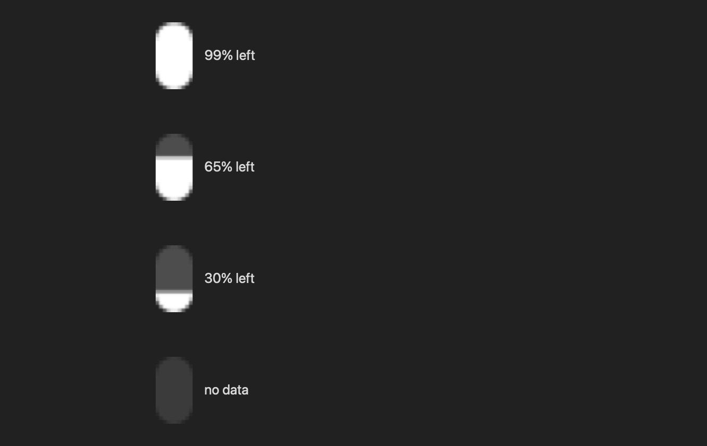

# ClaudeMeter

极简的 Claude 用量菜单栏指示器 —— 菜单栏里**只有一根竖条**，填充高度 = 5 小时会话的剩余用量。



没有百分比、没有图标、没有文字。点开才看详情。

## 特点

- **极简**：菜单栏只有一个 10×18pt 的胶囊竖条，其余什么都不显示
- **单色**：`isTemplate` 图渲染，自动跟随菜单栏浅色/深色，不抢眼
- **点击看详情**：5 小时会话 + 每周用量、各自的重置时间、手动刷新
- **60 秒轮询**，点开面板时也会额外刷新一次
- **零依赖**：只用 `swiftc` 编译，不引入任何第三方库
- **凭证安全**：`sessionKey` 存 macOS 钥匙串，只有非敏感的 org id 放在 UserDefaults

## 系统要求

- macOS 13+（用到了 SwiftUI 的 `MenuBarExtra`）
- 只需要 Command Line Tools（`xcode-select --install`），**不需要完整 Xcode**

## 安装

```bash
git clone https://github.com/hanhaoxuan114514-glitch/claude-meter.git
cd claude-meter
./build.sh --install
```

`--install` 会编译、打包成 `.app`、拷到 `/Applications` 并启动。不加参数则只打包到当前目录。

## 配置凭证

App 需要两样东西：claude.ai 的 `sessionKey` cookie 和你的组织 ID。

1. 浏览器登录 [claude.ai](https://claude.ai)，打开 DevTools（`⌥⌘I`）
2. 进 **Application → Cookies → `https://claude.ai`**
3. 复制 `sessionKey` 的值（形如 `sk-ant-sid...`）和 `lastActiveOrg` 的值（一个 UUID）

然后写入：

```bash
# sessionKey → 钥匙串
security add-generic-password -A \
  -s com.claudemeter.credentials -a sessionKey \
  -w 'sk-ant-sid...' -U

# org id → UserDefaults
defaults write local.claudemeter org_id -string '1234abcd-....'
```

重启 App 即可。

> `-A` 表示允许任意 App 读取该条目且不弹窗，适合本机自用工具。想要更严格就去掉 `-A`，改成 `-T /Applications/ClaudeMeter.app`（代价是每次重新编译后要重新授权一次）。

## 开机自启动

```bash
./login-item.sh install     # 启用
./login-item.sh status      # 查看状态
./login-item.sh uninstall   # 关闭
```

App 是本地编译的（未签名、未公证），macOS 的 `SMAppService` 不接受它注册登录项，所以这里用一个标准的**用户级 LaunchAgent** —— 只写你自己的 `~/Library/LaunchAgents`，不碰系统目录。没有设置 `KeepAlive`，手动退出后不会被自动拉起。

## 自定义

主要参数都在 `main.swift` 的 `batteryBarImage()` 附近：

| 想改什么 | 改哪里 |
|---|---|
| 竖条粗细 / 高度 | `let w: CGFloat = 10, h: CGFloat = 18` |
| 底槽深浅 | `withAlphaComponent(fraction == nil ? 0.12 : 0.20)` |
| 轮询间隔 | `Timer(timeInterval: 60, repeats: true)` |
| 菜单栏改显示周用量 | `var barFraction` 里的 `sessionRemaining` → `weeklyRemaining` |

改完重新编译安装：

```bash
./build.sh --install
```

## 实现说明

- 用量来自 claude.ai 的内部接口 `GET /api/organizations/{orgId}/usage`（**非公开、未文档化**，随时可能变）
- JSON 只声明了需要的字段（`five_hour` / `seven_day` 的 `utilization` 和 `resets_at`），其余一律忽略 —— 这样接口增删字段不会把解析搞崩
- `resets_at` 是 6 位小数的 ISO8601，用 `ISO8601DateFormatter` + `.withFractionalSeconds` 解析
- 竖条是一张 `isTemplate = true` 的 `NSImage`：先画一个恒定胶囊作为底槽，再把填充裁剪进同一个胶囊，从底部升起 —— 这样轮廓永远是完整胶囊，不会因为剩余比例低而变形

## 已知限制

- 依赖 claude.ai 的非公开接口，Anthropic 一改就可能失效
- `sessionKey` 有效期约 30 天，过期后竖条会变成空底槽（面板里会说明原因），需要重新配置
- 未签名、未公证；因为本地编译不会带隔离标记，通常可以直接打开

## License

MIT
